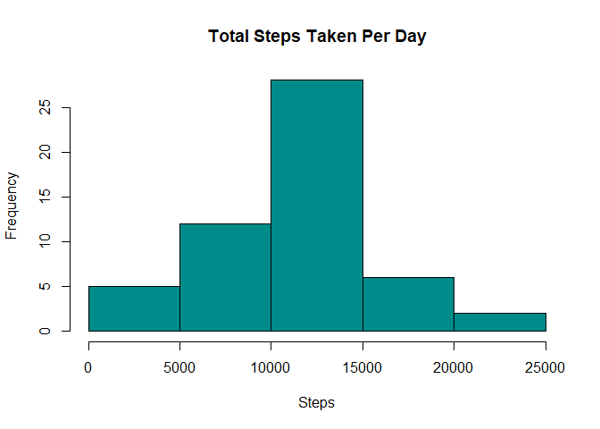
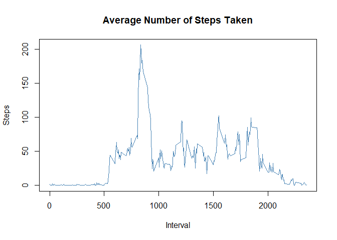
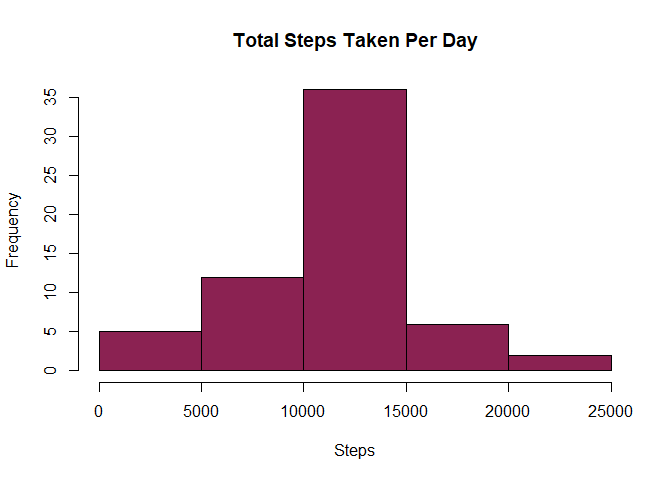
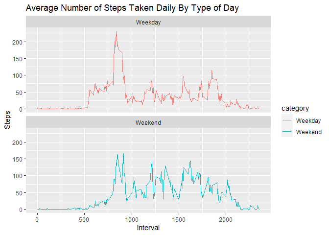

## Loading and preprocessing the data


```r
zip_url <- "https://d396qusza40orc.cloudfront.net/repdata%2Fdata%2Factivity.zip"

download.file(zip_url, "dataset.zip")

unzip("dataset.zip")

data <- read.csv("activity.csv")
```

## What is mean total number of steps taken per day?

Calculating the total number of steps taken per day.


```r
steps <- aggregate(steps ~ date, data, sum)
```

Generating histogram of the total number of steps taken per day.


```r
      hist(steps$steps,
           col = "darkcyan", 
           xlab = "Steps", 
           main = "Total Steps Taken Per Day")
```

<!-- -->

Calculating mean and median of the total number of steps taken per day.


```r
      mean_steps <- mean(steps$steps)
      
      median_steps <- median(steps$steps)
```


## What is the average daily activity pattern?

Generating time series plot of the 5-minute interval and the average number of steps taken, averaged across all days.


```r
      steps <- aggregate(steps ~ interval, data, mean)
      
      plot(steps ~ interval, 
           data = steps, 
           type = "l", 
           col = "steelblue",
           xlab = "Interval",
           ylab = "Steps",
           main = "Average Number of Steps Taken")
```

<!-- -->

Calculating which 5-interval contains the maximum number of steps.


```r
maximum_steps <- steps[which.max(steps$steps), ]$interval
```

## Imputing missing values

Calculating the total number of missing values in the dataset. 


```r
      missing_values <- is.na(data$steps)
      
      total <- sum(missing_values)
```

Replacing missing values in dataset. 


```r
      steps <- aggregate(steps ~ interval, data, mean)
      
      step_mean <- function(interval)  {
         steps[steps$interval == interval, ]$steps
      }
      
      complete_data <- data
      for (entry in 1:nrow(complete_data))  {
         if (is.na(complete_data[entry, ]$steps)) {
            complete_data[entry, ]$steps <- step_mean(complete_data[entry, ]$interval)
         }
      }
```

Generating histogram of the total number of steps taken each day.


```r
      steps <- aggregate(steps ~ date, complete_data, sum)
      
      hist(steps$steps,
           col = "violetred4", 
           xlab = "Steps", 
           main = "Total Steps Taken Per Day")
```

<!-- -->

Calculating mean and median total number of steps taken per day.


```r
      mean_steps <- mean(steps$steps)
      
      median_steps <- median(steps$steps)
```

## Are there differences in activity patterns between weekdays and weekends?

Generating new factor variable with two levels - "weekday" and "weekend".


```r
      complete_data$date <- as.Date(strptime(complete_data$date, format = "%Y-%m-%d"))
      
      complete_data$category <- weekdays(complete_data$date)
      for (entry in 1:nrow(complete_data))   {
         if (complete_data[entry, ]$category %in% c("Monday", "Tuesday", "Wednesday", "Thursday", "Friday")){
            complete_data[entry, ]$category <- "Weekday"
         }
         else  {
            complete_data[entry, ]$category <- "Weekend"
         }
      }
```

Generating panel plot containing time series plot of the 5-minute interval(x-axis) and the average number of steps taken, averaged across all weekday days or weekend days (y-axis).   


```r
      library(ggplot2)
      
      steps <- aggregate(steps ~ interval + category, complete_data, mean)
      
      g <- ggplot(steps, mapping = aes(x = interval, y = steps, color = category)) + 
         geom_line() +
         xlab("Interval") + 
         ylab("Steps") + 
         ggtitle("Average Number of Steps Taken Daily By Type of Day") +
         facet_wrap(~category, nrow = 2, ncol = 1)
      
      print(g)
```

<!-- -->
